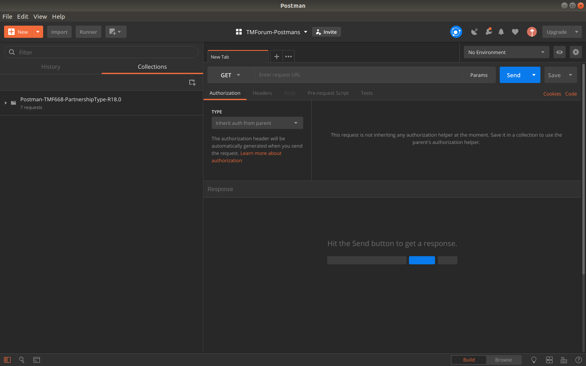
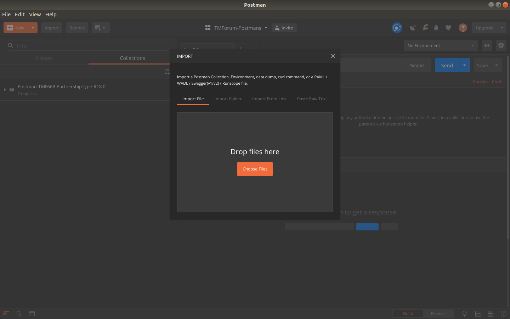

# Postman Collection TMF668 - Partnership Type Management #

To use the Postman Collection you need:

1. You need to download [Postman from https://www.getpostman.com](https://www.getpostman.com)

It will look like this after installed:

2. Now you can click on File then on Import (Ctrl + o) to get to this screen:

3. After you select both the .postman_collection.json and the .postman_environment.json on your files you will have an option to select an Envirionment (To Right Corner):

4. On the left corner you can expand the Collection folder to see the tests, you can click on each and explore the Headers, body, and tests. It will look similar to this:

